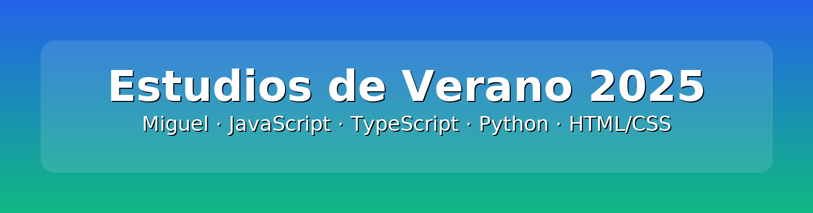

  

<h1 align="center">Estudios de Verano 2025</h1>

> ✍️ **Estudios y aprendizajes que estoy haciendo durante el verano.**  
> Me centro en reforzar la base web y la lógica de programación con ejercicios cortos

---

### 📂 Proyectos destacados

- 🔧 [DAW-1--Proyectos](https://github.com/miguel-pc-09/DAW-1--Proyectos)
- 🛠️ [DAW-2--Proyectos](https://github.com/miguel-pc-09/DAW-2--Proyectos)

---

## 🔗 Repositorio Personal

Desarrollado por **Miguel Ángel Perucha Castelló**  
- 📧 [m.peruchacastello@gmail.com](mailto:m.peruchacastello@gmail.com)
- 🐙 [GitHub](https://github.com/miguel-pc-09)
- <a href="https://www.linkedin.com/in/miguel-angel-perucha-castello" target="_blank">
    &nbsp;LinkedIn
  </a>

---

⭐ _Gracias por visitar mi perfil. ¡Estoy disponible para aprender, colaborar y crecer profesionalmente!_
